# Multi-Camera Video AI: Modern Learning Path (2025)

**Last Updated**: January 2026

**Framework Versions**: DeepStream 8.0, Savant 0.6.0, YOLO11, GStreamer 1.24+

**Target Hardware**: NVIDIA Jetson (Orin/Thor) & Data Center GPUs (Ampere/Ada/Hopper/Blackwell)

---

## 🎯 Quick Overview

This guide teaches you to build production-ready multi-camera AI systems step-by-step.

```mermaid
graph TD
    A[📚 Foundations<br/>Video Basics] --> B[🤖 Single-Stream AI<br/>Detection & Tracking]
    B --> C[⚡ Streaming Stack<br/>GStreamer & DeepStream]
    C --> D[📹 Multi-Stream Pipelines<br/>4+ Cameras]
    D --> E[🌐 MTMC Tracking<br/>Cross-Camera IDs]
    E --> F[🚀 Production<br/>Monitoring & Scaling]

    style A fill:#e3f2fd,stroke:#1e88e5,color:#0d47a1,stroke-width:1px
    style B fill:#fff3e0,stroke:#ef6c00,color:#e65100,stroke-width:1px
    style C fill:#f3e5f5,stroke:#6a1b9a,color:#4a148c,stroke-width:1px
    style D fill:#e8f5e9,stroke:#2e7d32,color:#1b5e20,stroke-width:1px
    style E fill:#fce4ec,stroke:#ad1457,color:#880e4f,stroke-width:1px
    style F fill:#fff9c4,stroke:#f9a825,color:#f57f17,stroke-width:1px
```



---

## 📋 Prerequisites

- ✅ Basic Python (functions, loops, classes)
- ✅ Linux command line comfort
- ✅ NVIDIA hardware (Jetson Orin or datacenter GPU)
- ✅ Ubuntu 22.04+ or 24.04

---

## 🎬 Phase 1 — Video Streams & Frames (Single Camera)

### 🧠 WHY

If you can’t **open a stream, keep it stable, and recover from disconnects**, everything else (DeepStream, multi-stream, MTMC) becomes a house of cards.

### 📌 WHAT

- **Inputs**: RTSP vs file vs webcam
- **Performance**: FPS, CPU/GPU load, dropped frames
- **Latency**: buffering + decode + display delay
- **Reliability**: timeouts, reconnect, “camera died” events

### 🛠 HOW (Do This First)

1. Open **one** stream
2. Display frames at stable FPS
3. Log:
   - dropped frames / read failures
   - time since last good frame
   - reconnect attempts
4. Recover when the stream drops (reconnect + backoff)

### Core Concept Diagram

```mermaid
graph LR
    classDef source fill:#90caf9,stroke:#1e88e5,color:#0d47a1,stroke-width:1px
    classDef process fill:#c8e6c9,stroke:#2e7d32,color:#1b5e20,stroke-width:1px
    classDef decision fill:#f3e5f5,stroke:#6a1b9a,color:#4a148c,stroke-width:1px
    classDef output fill:#ffe0b2,stroke:#ef6c00,color:#e65100,stroke-width:1px

    A[📹 RTSP Camera] -->|Network Stream| B[📺 OpenCV Capture]
    B --> C{🎬 Process Frame}
    C --> D[✏️ Add Overlays<br/>FPS, Boxes]
    D --> E[🖥️ Display Window]

    class A source
    class B process
    class C decision
    class D process
    class E output
```



### Quick Start (Minimal)

```bash
# Install
pip install opencv-python

# Test RTSP
python simple_rtsp.py
```

### Minimal Code (Baseline Loop — extend it)

```python
# simple_rtsp.py
import cv2, time

cap = cv2.VideoCapture("rtsp://camera-url")
start = time.time()
frames = 0

while True:
    ret, frame = cap.read()
    if not ret:
        # TODO: log failure + reconnect with backoff instead of exiting
        break
    
    frames += 1
    fps = frames / (time.time() - start)
    
    # Overlay FPS
    cv2.putText(frame, f"FPS: {fps:.1f}", (10, 30), 
                cv2.FONT_HERSHEY_SIMPLEX, 1, (0,255,0), 2)
    
    cv2.imshow('Stream', frame)
    if cv2.waitKey(1) == ord('q'): break

cap.release()
```

### ✅ Success Criteria

- Holds **20+ FPS** (or your target FPS) for 5+ minutes
- Recovers after stream drop without restarting the app
- CPU doesn’t peg at 100% just to display video
- You can explain **why latency happens** (network + buffering + decode)

### 💡 Skeptical note

If it stutters here, don’t even think “DeepStream”. Fix *this* first.

---

## 🎯 Phase 2 — Detection & Tracking (Single Camera AI)

### 🧠 WHY

Multi-camera means nothing if a single stream can’t **detect + track stably**. This phase builds the core behavior you’ll later scale.

### 📌 WHAT

- Detector choices (YOLO vs RT-DETR vs RF-DETR)
- ByteTrack intuition + ID stability
- Confidence thresholds + false positives
- Why ID switches happen (and how to reduce them)

### 🛠 HOW (Do This)

1. Run detection on one video/stream
2. Add tracking (ByteTrack)
3. Export tracking data to CSV
4. Tune thresholds & observe ID switches during occlusions

### ✅ Success Criteria

- IDs remain stable across short occlusions
- False positives don’t explode
- CPU/GPU remains reasonable
- You can explain why ID switches happen

### 💡 Honesty moment

If you can’t tune thresholds, you’re not “doing AI” — you’re pressing buttons.

### AI Pipeline Diagram

```mermaid
graph LR
    classDef input fill:#e3f2fd,stroke:#1e88e5,color:#0d47a1,stroke-width:1px
    classDef model fill:#fff3e0,stroke:#ef6c00,color:#e65100,stroke-width:1px
    classDef compute fill:#f3e5f5,stroke:#6a1b9a,color:#4a148c,stroke-width:1px
    classDef decision fill:#ede7f6,stroke:#5e35b1,color:#311b92,stroke-width:1px
    classDef output fill:#e8f5e9,stroke:#2e7d32,color:#1b5e20,stroke-width:1px

    A[📸 Video Frame] --> B[🎯 AI Detector]
    B --> C[👤 ByteTrack<br/>Object Tracking]
    C --> D{📋 Tracked Objects<br/>with IDs}
    D --> E[✏️ Draw Results<br/>Boxes + Labels]

    B1[YOLO11<br/>Fast & Simple] -.-> B
    B2[RT-DETR<br/>High Accuracy] -.-> B
    B3[RF-DETR<br/>Max Precision] -.-> B

    class A input
    class B compute
    class C compute
    class D decision
    class E output
    class B1 model
    class B2 model
    class B3 model
```



### 🚀 **2025 Paradigm Shift: Transformers vs CNNs**

Object detection has fundamentally evolved - **transformer-based detectors now match or exceed YOLO** in both speed and accuracy.

<details>
<summary><strong>Model options (January 2026) — keep it simple</strong></summary>

### Technology Choices (January 2026)

#### **Option A: YOLO11** (CNN-Based) ✅ **EASIEST TO START**

**Status**: Latest stable (v8.3.246)  
**Best for**: Learning, quick prototyping, established pipelines

**Pros**:
- Easiest to learn and deploy
- Ultralytics ecosystem (great docs)
- Works everywhere (CPU, GPU, edge)
- Massive community support

**Cons**:
- Requires NMS (post-processing)
- Poorer domain transfer than transformers
- Limited to ~54 AP on COCO

#### **Option B: RT-DETR** (Transformer) ✅ **BEST BALANCE**

**Status**: RT-DETRv4 (October 2025) - Latest  
**Best for**: Production, better accuracy, future-proof

**Pros**:
- No NMS needed (end-to-end)
- **55.8 AP** @ real-time speed
- Ultralytics integrated (easy switch from YOLO)
- Official DeepStream 8.0 support
- Better small object detection

**Cons**:
- Slightly slower than YOLO on CPU
- Newer technology (less community content)

#### **Option C: RF-DETR** (NAS Transformer) ⭐ **MAXIMUM ACCURACY**

**Status**: November 2025 release  
**Best for**: When accuracy is critical, custom domains

**Pros**:
- **60.5 AP** - First 60+ mAP real-time model
- Best domain transfer (RF100-VL: 48.2 mAP)
- Neural architecture search (auto-optimize)
- Apache 2.0 license (commercial friendly)

**Cons**:
- Requires more setup (not in Ultralytics yet)
- Higher latency for max accuracy
- Smaller community

#### **Option D: NVIDIA TAO Models** ✅ **DEEPSTREAM NATIVE**

**Best for**: NVIDIA hardware, production edge deployment

**Popular models**: PeopleNet, DashCamNet, TrafficCamNet
</details>

### Quick Start (Updated January 2026)

**Choose Your Path:**

```bash
# Option A: YOLO11 (Easiest - Recommended for beginners)
pip install ultralytics
```

```python
from ultralytics import YOLO

model = YOLO('yolo11n.pt')  # Nano model
results = model.track('video.mp4', tracker='bytetrack.yaml', persist=True)

for result in results:
    boxes = result.boxes
    for box in boxes:
        track_id = int(box.id) if box.id else -1
        print(f"ID:{track_id} Class:{int(box.cls)} Conf:{box.conf:.2f}")
```

```bash
# Option B: RT-DETR (Transformer power)
pip install ultralytics
```

```python
from ultralytics import RTDETR

model = RTDETR('rtdetr-l.pt')  # Uses RT-DETRv4 under hood
results = model.track('video.mp4', persist=True)
# Same API as YOLO!
```

```bash
# Option C: RF-DETR (Maximum accuracy)
pip install roboflow
```

```python
from roboflow import Roboflow

rf = Roboflow(api_key="YOUR_KEY")
project = rf.workspace().project("YOUR_PROJECT")
model = project.version(1).model

# Inference with NAS-optimized config
results = model.predict('image.jpg', confidence=40)
```

### Model Comparison (COCO Benchmark)

| Model | AP | Speed (T4) | Params | Best For |
|-------|-----|------------|--------|----------|
| YOLO11n | 39.5 | 1.5ms | 2.6M | Learning, CPU |
| YOLO11m | 51.5 | 4.6ms | 20.1M | Balanced |
| YOLO11x | 54.7 | 11.9ms | 56.9M | Accuracy |
| **RT-DETR-R50** | **53.1** | **9.3ms** | 42M | Real-time balance |
| **RT-DETRv4-R50** | **55.8** | **~8ms** | 42M | SOTA real-time ⭐ |
| **RF-DETR-2x-l** | **60.5** | **40ms** | 129M | Maximum accuracy 🏆 |

**💡 Recommendation**: Start with **YOLO11m** for learning, migrate to **RT-DETRv4** for production.

### Key Concepts

**ByteTrack** (State-of-the-art 2025):
1. Match high-confidence detections (>0.6) first
2. Match low-confidence detections (0.1-0.5) to unmatched tracks
3. Result: Fewer ID switches during occlusions

### Checkpoints
- [ ] Track 5+ people across 60-second video
- [ ] <5% identity switches
- [ ] Export tracking data to CSV
- [ ] Understand confidence thresholds
- [ ] Try both CNN (YOLO11) and Transformer (RT-DETR)

**Resources**:
- **YOLO11**: [docs.ultralytics.com/models/yolo11](https://docs.ultralytics.com/models/yolo11/)
- **RT-DETR**: [docs.ultralytics.com/models/rtdetr](https://docs.ultralytics.com/models/rtdetr/)
- **RF-DETR**: [github.com/roboflow/rf-detr](https://github.com/roboflow/rf-detr)
- **Transformer Deep Dive**: See "Transformer Detector Research" artifact
- **ByteTrack Paper**: [arxiv.org/abs/2110.06864](https://arxiv.org/abs/2110.06864)

---

## ⚙️ Phase 3 — Streaming Pipelines (Decode → Infer → Display)

### 🧠 WHY

OpenCV is fine for one stream, but it collapses under multi-streams. You need **GStreamer / DeepStream** so the GPU actually earns its salary.

### 📌 WHAT

- Hardware decode
- Batching (`nvstreammux`)
- Inference + metadata
- Queueing & backpressure (why buffers get “stuck”)
- Latency measurement (not vibes)

### 🛠 HOW (Hands-on)

1. Run a DeepStream sample app (known-good pipeline)
2. Swap in your source (your RTSP)
3. Inspect metadata (detections/tracks)
4. Tune:
   - batch size
   - RTSP latency/jitter buffer
   - decode + queue settings

### ✅ Success Criteria

- Real-time remains real-time (measured FPS + latency)
- You can point to bottlenecks with data (decode vs infer vs render)
- You can sketch the pipeline without crying

### GStreamer Pipeline Diagram

```mermaid
graph LR
    classDef input fill:#e3f2fd,stroke:#1e88e5,color:#0d47a1,stroke-width:1px
    classDef compute fill:#f3e5f5,stroke:#6a1b9a,color:#4a148c,stroke-width:1px
    classDef output fill:#e8f5e9,stroke:#2e7d32,color:#1b5e20,stroke-width:1px

    A[📡 rtspsrc<br/>RTSP Input] --> B[📦 rtph264depay<br/>Unwrap RTP]
    B --> C[🔍 h264parse<br/>Parse H264]
    C --> D[🚀 nvv4l2decoder<br/>GPU Decode]
    D --> E[📊 nvstreammux<br/>Batch Streams]
    E --> F[🧠 nvinfer<br/>AI Inference]
    F --> G[👤 nvtracker<br/>Track Objects]
    G --> H[✏️ nvosd<br/>Draw Overlays]
    H --> I[📺 Display Sink]

    class A input
    class B input
    class C input
    class D compute
    class E compute
    class F compute
    class G compute
    class H output
    class I output
```



### DeepStream 8.0 Key Elements

| Element | Purpose | Example |
|---------|---------|---------|
| `rtspsrc` | RTSP input | `location="rtsp://camera:554"` |
| `nvv4l2decoder` | HW decode | H264/H265 GPU decode |
| `nvstreammux` | Batch streams | Combine 4 cameras |
| `nvinfer` | AI inference | Run TensorRT models |
| `nvtracker` | Object tracking | IOU/NvDCF/DeepSORT |
| `nvosd` | Draw overlays | Bboxes, text |

### Installation

```bash
# Download DeepStream 8.0
wget https://catalog.ngc.nvidia.com/orgs/nvidia/resources/deepstream

# Install
sudo apt-get install ./deepstream-8.0_*.deb

# Verify
deepstream-app --version
```

### Quick Start

```bash
# Run with 4 streams
cd /opt/nvidia/deepstream/deepstream-8.0/samples
deepstream-app -c configs/source4_1080p_dec_infer_resnet_int8.txt
```

### Minimal Python (Pseudo-code)

```python
import gi
gi.require_version('Gst', '1.0')
from gi.repository import Gst

Gst.init(None)

# Build pipeline
pipeline_str = """
    rtspsrc location=rtsp://camera ! 
    rtph264depay ! h264parse ! 
    nvv4l2decoder ! nvstreammux ! 
    nvinfer config-file-path=config.txt ! 
    nvosd ! nveglglessink
"""

pipeline = Gst.parse_launch(pipeline_str)
pipeline.set_state(Gst.State.PLAYING)

# Run loop
loop = GLib.MainLoop()
loop.run()
```

### Checkpoints
- [ ] Run deepstream-test1 through test4
- [ ] Modify config for your camera
- [ ] Access detection metadata
- [ ] Compare GPU vs DLA performance

**Resources**:
- DeepStream Docs: [docs.nvidia.com/metropolis/deepstream](https://docs.nvidia.com/metropolis/deepstream/dev-guide/)
- GStreamer `rtspsrc`: [gstreamer.freedesktop.org/documentation/rtsp/rtspsrc.html](https://gstreamer.freedesktop.org/documentation/rtsp/rtspsrc.html)
- GStreamer RTP plugin: [gstreamer.freedesktop.org/documentation/rtp/index.html](https://gstreamer.freedesktop.org/documentation/rtp/index.html)

---

## 📡 Phase 4 — Multi-Camera (4–16 Streams)

### 🧠 WHY

Now we test **reality vs PowerPoint**. This is where toy demos become systems that survive Mondays.

### 📌 WHAT

- Batch scheduling + decode contention
- Per-camera health monitoring
- Error-tolerant pipelines (one camera dies ≠ system dies)
- Metrics that mean something (FPS, drops, latency)

### Multi-Camera Architecture

```mermaid
graph TB
    classDef camera fill:#e3f2fd,stroke:#1e88e5,color:#0d47a1,stroke-width:1px
    classDef compute fill:#f3e5f5,stroke:#6a1b9a,color:#4a148c,stroke-width:1px
    classDef output fill:#e8f5e9,stroke:#2e7d32,color:#1b5e20,stroke-width:1px

    subgraph "📹 Camera Sources"
        direction LR
        C1[📷 Cam 1]
        C2[📷 Cam 2]
        C3[📷 Cam 3]
        C4[📷 Cam 4]
    end

    subgraph "⚡ GPU Processing"
        C1 --> MUX[📊 nvstreammux<br/>Batch 4 Streams]
        C2 --> MUX
        C3 --> MUX
        C4 --> MUX
        MUX --> INF[🧠 nvinfer<br/>AI Detection]
        INF --> TRK[👤 nvtracker<br/>Per-Camera Tracking]
    end

    subgraph "📤 Outputs"
        TRK --> OUT1[🖥️ Live Display]
        TRK --> OUT2[💾 Video Recording]
        TRK --> OUT3[📨 Kafka Events]
    end

    class C1 camera
    class C2 camera
    class C3 camera
    class C4 camera
    class MUX compute
    class INF compute
    class TRK compute
    class OUT1 output
    class OUT2 output
    class OUT3 output
```



### NVIDIA Reference: jetson-multicamera-pipelines

This project builds a typical multi-camera pipeline using GStreamer and DeepStream, providing programmatic access via Python.

```bash
# Install
git clone https://github.com/NVIDIA-AI-IOT/jetson-multicamera-pipelines.git
cd jetson-multicamera-pipelines
bash scripts/install_dependencies.sh
pip3 install .
```

### Minimal Code (Pseudo-code)

```python
from jetmulticam import CameraPipelineDNN
from jetmulticam.models import PeopleNet, DashCamNet

pipeline = CameraPipelineDNN(
    cameras=[0, 1, 2],  # 3 cameras
    models=[PeopleNet.DLA1, DashCamNet.DLA0],
    save_video=True,
    display=True
)

while pipeline.running():
    frame_cam0 = pipeline.images[0]  # np.array (1080, 1920, 3)
    dets_cam0 = pipeline.detections[0]  # Detection list
    # Your logic here
```

### Performance Benchmarks (Jetson Xavier NX)

| Cameras | DNNs | CPU | GPU | Power |
|---------|------|-----|-----|-------|
| 1 | 2 DLAs | 9.3% | <3% | 8.5W |
| 2 | 2 DLAs | 14.9% | <3% | 9.4W |
| 3 | 2 DLAs | 20.5% | <3% | 10.1W |
| 5 | 2 DLAs | 20.8% | <3% | 9.1W |

*Source: NVIDIA jetson-multicamera-pipelines*

### Common Issues & Fixes

**Issue**: Black screens on some cameras  
**Fix**: Adjust `batch-size` and `buffer-pool-size` in nvstreammux

**Issue**: Stream delays/desync  
**Fix**: Set `rtspsrc latency=50` and match camera FPS

**Issue**: Memory leaks  
**Fix**: Properly unref `NvBufSurface` in Python

### 🛠 HOW (Do This)

1. Start with **2 streams**
2. Scale to **4 → 8 → 12 → 16**
3. Log per camera:
   - FPS
   - dropped frames / packet drops
   - reconnect count
   - time since last frame
4. Log system-wide:
   - CPU (%), GPU util (%), memory
   - end-to-end latency (frame in → overlay out)

### ✅ Success Criteria

- Scaling doesn’t tank FPS (measured)
- A crashed camera doesn’t crash the system
- Logs let you explain issues quickly (desync, stalls, drops)

### 💡 Reality check

If you ignore logs & metrics, production will teach you — the hard way.

---

## 🔗 Phase 5 — Cross-Camera Identity (MTMC)

### 🧠 WHY

Real systems need **global IDs**, not “Person 5 here and Person 27 there”.

### 📌 WHAT

- ReID embeddings (appearance vectors)
- Cosine similarity (matching)
- Spatio-temporal constraints + camera topology
- Track fusion logic (global ID assignment)

### MTMC Concept Diagram

```mermaid
graph TD
    classDef camera fill:#e3f2fd,stroke:#1e88e5,color:#0d47a1,stroke-width:1px
    classDef compute fill:#f3e5f5,stroke:#6a1b9a,color:#4a148c,stroke-width:1px
    classDef highlight fill:#fff3e0,stroke:#ef6c00,color:#e65100,stroke-width:1px
    classDef global fill:#e8f5e9,stroke:#2e7d32,color:#1b5e20,stroke-width:1px

    subgraph "📹 Camera 1"
        C1D[🎯 Detect] --> C1T[👤 Track: Local_005]
        C1T --> C1R[🧬 ReID Vector]
    end

    subgraph "📹 Camera 2"
        C2D[🎯 Detect] --> C2T[👤 Track: Local_012]
        C2T --> C2R[🧬 ReID Vector]
    end

    subgraph "📹 Camera 3"
        C3D[🎯 Detect] --> C3T[👤 Track: Local_003]
        C3T --> C3R[🧬 ReID Vector]
    end

    C1R --> FUSION[🔗 MTMC Fusion<br/>Match Across Cameras]
    C2R --> FUSION
    C3R --> FUSION
    FUSION --> GID[🌟 Global ID: 42<br/>Same Person!]

    class C1D camera
    class C1T compute
    class C1R compute
    class C2D camera
    class C2T compute
    class C2R compute
    class C3D camera
    class C3T compute
    class C3R compute
    class FUSION highlight
    class GID global
```



### 🛠 HOW (Do This)

1. Extract embeddings per camera (ReID vectors)
2. Compare candidates across cameras (cosine similarity)
3. Add constraints:
   - time windows (min/max travel time)
   - camera adjacency (topology)
4. Evaluate ID consistency and visualize results

### ✅ Success Criteria

- Same person → consistent ID across cameras (most of the time)
- Errors reduce when you add constraints (measured)
- You can visualize matches and explain failures

### 💡 Truth bomb

MTMC is not magic. Bad embeddings = bad matches = angry users.

### MTMC Pipeline

1. **Per-Camera Tracking** (DeepStream)
   - Detect objects
   - Track within each camera
   - Extract ReID embeddings

2. **ReID Feature Extraction**
   - Use NVIDIA TAO ReIdentificationNet
   - Generate 128D appearance vectors

3. **MTMC Fusion Service**
   - Compare embeddings across cameras
   - Apply spatio-temporal constraints
   - Assign global IDs

### Minimal Logic (Pseudo-code)

```python
class MTMCFusion:
    def __init__(self):
        self.global_tracks = {}
        self.next_id = 1
    
    def match(self, camera_tracks):
        # 1. Compute embedding distances
        for track1 in camera_tracks:
            for track2 in camera_tracks:
                if track1.camera_id == track2.camera_id:
                    continue
                
                # Cosine similarity
                dist = 1 - cosine(track1.reid_vec, track2.reid_vec)
                
                # Spatio-temporal check
                if is_valid_transition(track1, track2, dist):
                    # Same global ID
                    assign_global_id(track1, track2)
```

### Key Technologies

**ReID** (Re-Identification):
- Extract appearance embeddings
- Same person → similar vectors
- Different people → different vectors

**Constraints**:
- **Spatial**: Camera topology (which cameras are adjacent)
- **Temporal**: Min/max travel time between cameras

### Checkpoints
- [ ] Extract ReID features from DeepStream
- [ ] Implement distance-based matching
- [ ] Add temporal constraints
- [ ] Visualize global IDs

**Resources**:
- NVIDIA MTMC: [docs.nvidia.com/metropolis/deepstream (MV3DT)](https://docs.nvidia.com/metropolis/deepstream/dev-guide/text/DS_3D_MultiView_MultiModal_3D_Tracking.html)
- Ristani CVPR 2018: Classic MTMC paper

---

## 🧰 Phase 6 — Framework Layer (Savant, etc.)

### 🧠 WHY

Once you understand the raw stack, frameworks can make you faster — **without turning you into a dependent zombie**.

### 📌 WHAT

- High-level config pipelines (YAML)
- Dynamic updates
- Built-in monitoring + failure handling
- Trade-off: abstraction vs control

Savant 0.6.0 (latest) is built on DeepStream 7.1 and provides a high-level Python framework for building real-time streaming AI applications.

### Why Savant?

| Feature | Raw DeepStream | Savant |
|---------|----------------|--------|
| Language | C++ + Python bindings | Python + YAML |
| Config | Multiple .txt files | Single YAML |
| Runtime Changes | Restart required | Dynamic updates |
| Error Handling | Manual | Built-in retry |
| Monitoring | DIY | OpenTelemetry |

### 🛠 HOW (Do This)

1. Rebuild one known-good pipeline in Savant (or similar framework)
2. Compare:
   - clarity (is it easier to reason about?)
   - maintainability (less glue code?)
   - resilience (reconnect, retries, metrics)

### ✅ Success Criteria

- You aren’t fighting the framework
- It improves — not hides — your understanding

### 💡 Skeptic lens

If a framework claims “no DeepStream knowledge needed” — run.

### Quick Start

```bash
# Pull Docker image
docker pull ghcr.io/insight-platform/savant-deepstream:0.6.0-7.1

# Run sample
docker run --gpus all savant-deepstream:0.6.0-7.1
```

### Minimal Pipeline (Pseudo-code)

```yaml
# pipeline.yml
name: multi_camera_peoplenet
parameters:
  frame:
    width: 1920
    height: 1080

pipeline:
  elements:
    - element: nvstreammux
      properties:
        batch-size: 4
    
    - element: nvinfer
      model:
        format: onnx
        remote:
          url: s3://models/peoplenet.onnx
```

```python
# Python processor
from savant_rs.pipeline2 import VideoPipeline

class PeopleCounter:
    def process_frame(self, frame):
        count = sum(1 for obj in frame.objects if obj.label == 'person')
        frame.add_tag('person_count', count)
        return frame

pipeline = VideoPipeline('pipeline.yml')
pipeline.add_processor(PeopleCounter())
pipeline.run()
```

---

## 🏭 Phase 7 — Production-Grade System

### 🧠 WHY

Now you stop being a lab hobbyist and start being someone Ops doesn’t hate.

### 📌 WHAT

- Docker GPU containers
- Health checks + alerts
- Metrics (Prometheus) + logs
- Event outputs (Kafka)
- Load testing + failure modes

### 🛠 HOW (Do This)

1. Containerize your pipeline (GPU-enabled)
2. Add per-camera health checks (alive/dead, time since last frame)
3. Export metrics:
   - per-camera FPS
   - dropped frames
   - **decode latency**
   - **inference latency**
   - end-to-end latency
   - GPU util, memory
4. Create alerts (camera down, FPS drop, latency spike)
5. Load test (start at 2 streams, scale up)

### ✅ Success Criteria

- A camera dying does **not** take down the system
- Metrics exist **before** things break
- You can explain bottlenecks with data — not vibes

### 💡 Grown-up rule

If it’s not monitored, it doesn’t exist.

### Production Architecture


### Key Metrics to Track

- 📊 Per-camera FPS
- 🔥 GPU utilization (%)
- ⏱️ Inference latency (ms)
- 💚 Stream health (alive/dead)
- 📈 Detection counts

### Deployment Checklist
- [ ] Containerize with Docker
- [ ] Set up Grafana dashboard
- [ ] Implement camera failover
- [ ] Configure alerts (PagerDuty/Slack)
- [ ] Load test with 8+ streams

### Docker Example

```dockerfile
FROM nvcr.io/nvidia/deepstream:8.0-triton-multiarch

COPY requirements.txt .
RUN pip install -r requirements.txt

COPY app/ /app
WORKDIR /app

CMD ["python3", "main.py"]
```

---

## 🧠 Complete Mindmap

```mermaid
mindmap
  root((🎥 Multi-Camera<br/>Video AI))
    📚 Foundations
      📺 Video Basics
        OpenCV I/O
        RTSP streams
        FPS monitoring
    🤖 Single-Stream AI
      🎯 Object Detection
        YOLO11 & RT-DETR
        Transformer models
      👤 Object Tracking
        ByteTrack algorithm
        Identity persistence
    ⚡ Streaming Stack
      ⚙️ GStreamer Pipeline
        rtspsrc, tee, queue
        Hardware decoding
      🚀 DeepStream 8.0
        nvstreammux batching
        nvinfer AI models
        nvtracker algorithms
    📹 Multi-Stream
      📹 4+ Camera Pipelines
        NVIDIA jetson-multicamera
        RTSP stream sharing
        Error recovery
    🌐 MTMC Tracking
      🔗 Cross-Camera IDs
        ReID embeddings
        Spatio-temporal fusion
        Global identity
    🚀 Production
      🐳 Containerization
        Docker deployment
        GPU optimization
      📊 Monitoring
        Prometheus metrics
        Grafana dashboards
      🚨 Alerting
        Health checks
        Failover systems
```



---

## 📈 Phase 8 — Continuous Benchmark & Model Literacy

### 🧠 WHY

Models change and hype cycles repeat. You want the **skill**, not the model name.

### 📌 WHAT

- Compare models by:
  - latency (decode + infer + end-to-end)
  - accuracy (your domain, not just COCO)
  - edge vs server fit
  - integration pain
- Reading papers without falling asleep (focus on claims + eval setup)
- Spotting benchmark tricks

### 🛠 HOW (Do This)

1. Pick 2–3 models to benchmark (example):
   - YOLO11 (baseline)
   - RT-DETR (transformer baseline)
   - RF-DETR (accuracy-focused)
2. Run on **your** hardware with the same input stream(s)
3. Record a simple truth table:
   - FPS per stream
   - dropped frames
   - decode latency (p50/p95)
   - inference latency (p50/p95)
   - end-to-end latency (p50/p95)
   - GPU util (%), memory
4. Write down trade-offs and the decision

### ✅ Success Criteria

- You can defend model choice logically
- You understand trade-offs (accuracy vs latency vs integration)
- You avoid hype traps

### 💡 Healthy skepticism

If a blog screams “10× faster!!!” …check the fine print.

---

## 📚 Key Resources (Updated January 2026)

### Official Documentation
- **DeepStream 8.0**: [docs.nvidia.com/metropolis/deepstream](https://docs.nvidia.com/metropolis/deepstream/dev-guide/)
- **YOLO11**: [docs.ultralytics.com/models/yolo11](https://docs.ultralytics.com/models/yolo11/)
- **RT-DETR (Ultralytics)**: [docs.ultralytics.com/models/rtdetr](https://docs.ultralytics.com/models/rtdetr/)
- **GStreamer**: [gstreamer.freedesktop.org](https://gstreamer.freedesktop.org/documentation/)
- **GStreamer `rtspsrc`**: [gstreamer.freedesktop.org/documentation/rtsp/rtspsrc.html](https://gstreamer.freedesktop.org/documentation/rtsp/rtspsrc.html)
- **GStreamer RTP plugin**: [gstreamer.freedesktop.org/documentation/rtp/index.html](https://gstreamer.freedesktop.org/documentation/rtp/index.html)
- **Savant 0.6.0**: [savant-ai.io](https://savant-ai.io)

### GitHub Repositories
- **jetson-multicamera-pipelines**: [github.com/NVIDIA-AI-IOT/jetson-multicamera-pipelines](https://github.com/NVIDIA-AI-IOT/jetson-multicamera-pipelines)
- **DeepStream Python Apps**: [github.com/NVIDIA-AI-IOT/deepstream_python_apps](https://github.com/NVIDIA-AI-IOT/deepstream_python_apps)
- **Savant**: [github.com/insight-platform/Savant](https://github.com/insight-platform/Savant)
- **Ultralytics**: [github.com/ultralytics/ultralytics](https://github.com/ultralytics/ultralytics)
- **RF-DETR**: [github.com/roboflow/rf-detr](https://github.com/roboflow/rf-detr)

### Research Papers
- **RT-DETR**: [arxiv.org/abs/2304.08069](https://arxiv.org/abs/2304.08069)

### Forums & Support
- **NVIDIA Developer Forums**: [forums.developer.nvidia.com](https://forums.developer.nvidia.com)
- **GStreamer Discourse**: [discourse.gstreamer.org](https://discourse.gstreamer.org)
